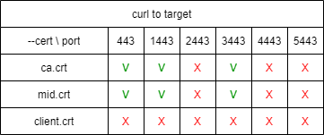
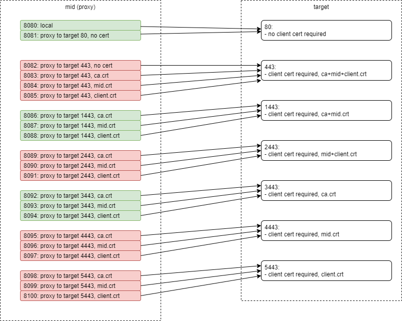

# Nginx GOST Encryption Test Stand

## Requirements

* HashiCorp Vagrant
* Oracle VirtualBox
* ansible
* WSL if run on Windows

### Running on Windows

Vagrant and VirtualBox should be installed in Windows, ansible - in WSL

## Usage

All commands should be executed either within WSL or from Linux/Mac native terminal.

* Clone repository and change directory into it:
  * `git clone https://git.epam.com/nikolay_golovin/nginx-gost-encryption.git`
  * `сd nginx-gost-encryption`
* Run `bash ./scripts/init.sh` for the initial setup of VM (virtual machine)
* Run `bash ./scripts/re-test.sh` to re-provision VM and to re-run the tests
* Run `bash ./scripts/remove.sh` to remove the VM

## Description

Init script downloads docker role from ansible-galaxy, sets up environment variables for WSL and then starts Vagrant box(es) and runs tests.
Configuration of Vagrant boxes are specified in vagrant/boxes.json file. Each JSON object represents a box (or VM).
Vagrant expects that each of the boxes in boxes.json has a base box specified and ansible playbook as provisioning instructions.

The GOST Encryption Test Stand use just one box with docker containers in it. There are two docker images that produce three docker containers:

* gost-tools - container with openssl and curl with gost-engine support; this container runs in ad-hoc manner and it is not persistent,
* nginx-mid - nginx container with gost-engine support that represents a proxy between the application and target site with GOST encryption,
* nginx-target - nginx container with gost-engine support that represents the target site that uses GOST encryption for both server and client authentication.

## Tests description

After the VM is spun up, the tests come into play. The tests are executed within the [scripts/tests.sh](scripts/tests.sh) shell script and are simple http/https requests powered by curl.
There are two main blocks of tests:

* The first block comprises the tests that run against nginx-target and use curl in the gost-tools docker container; these tests use https and certificates to authenticate.
* The second block of tests runs against nginx-mid and uses http without any certificates. The idea is for the nginx-mid to be the proxy that allowes the client be oblivious to the certificate authentication problem.

### Expected test results

Tests against nginx-target:

 Colored marks show test outcome: green - success, red - failure.

Tests against nginx-mid:

Color of rectangles shows test outcome: green - success, red - failure.
